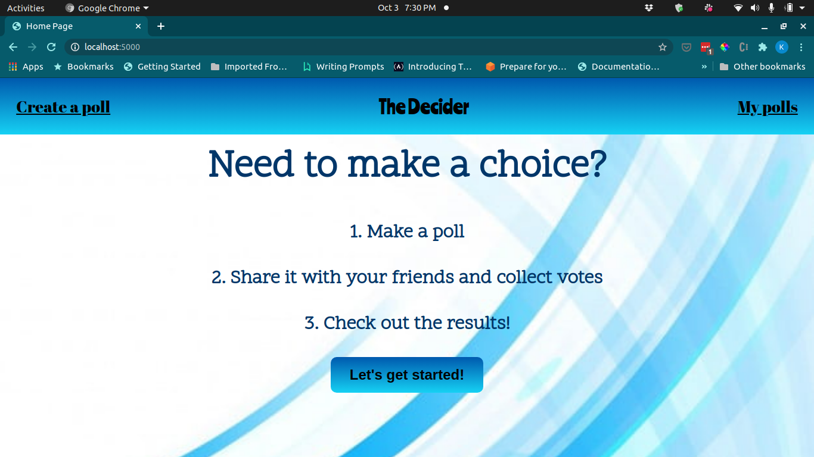
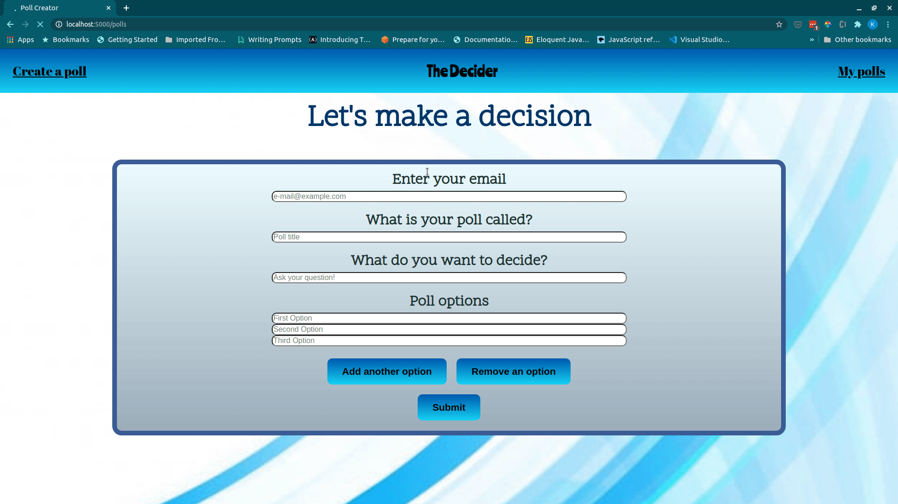
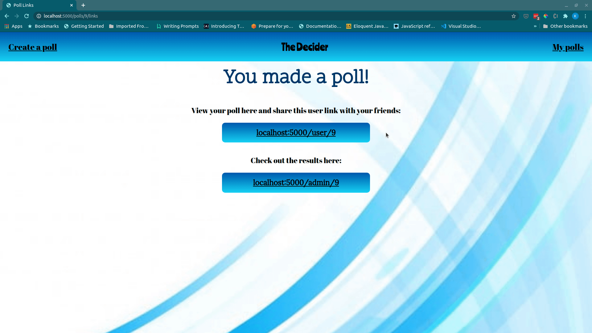

# The Decider

Having trouble deciding what to do with your friends on Friday night? Where to go for dinner? What movie to see?

Introducing The Decider: an app to help you make that tough choice!

Votes are ranked in order of preference so you can easily tell what the most popular choices are.

## App Features

Set up your poll with as many options as you want. If you add too many options, removing one (or two, or three, you get the idea!) is just a click away. 
Once the poll has been created you can share it with your friends or check out the poll results for the poll. The poll creator receives an email confirmation when a poll is created and when any votes are received. 
 

 
 
Polls are designed to allow for drag and drop voting. Users can optionally enter their name or be identified as a guest. 
 

 
 
Poll results can be viewed for any polls associated with the entered email and are displayed in a bar chart. This page also includes a list of voters in the poll. 
 

 

## Getting Started

Fork this repo and make a clone on your system.

1. Run npm install in the project directory.
2. Once dependencies are installed you can run the project using npm start.
3. The server will run on localhost:5000.

## Project Stack

- NodeJS
- Express
- jQuery
- SASS
- PostgresSQL
- EJS
- Mailgun API

## Dependencies

- Node 10.x or above
- NPM 5.x or above
- PG 6.x

## Authors

- Kelsi Proulx - [@Kelsi2 on Github](https://github.com/kelsi2)
- David Halpin - [@DevHalpin on Github](https://github.com/DevHalpin)
- Raphael Cordero - [@rafogi on Github](https://github.com/rafogi)
